# AWS Project 4 – Highly Available Team Status Dashboard

## Project Overview

This project demonstrates how to build and deploy a highly available web application on AWS using Amazon VPC, Amazon EC2, EC2 Auto Scaling, Application Load Balancer, Amazon RDS MySQL, private subnets, NAT Gateway, Security Groups, and Availability Zones.

The application is a Team Status Dashboard built with Python and Flask.

Users access the application through an Application Load Balancer. The load balancer distributes traffic between two EC2 instances running in separate Availability Zones. The Flask application connects to an Amazon RDS MySQL database to store team status updates.

The final architecture provides application-level high availability because the web application is running on two EC2 instances across two Availability Zones.

---

## Architecture

```text
                         INTERNET
                             |
                             v
                  +----------------------+
                  | Application Load     |
                  |      Balancer        |
                  |       HTTP :80       |
                  +----------+-----------+
                             |
                   +---------+---------+
                   |                   |
                   v                   v
            +-------------+     +-------------+
            |    EC2 #1   |     |    EC2 #2   |
            | us-east-1a  |     | us-east-1b  |
            |   Private   |     |   Private   |
            |   Subnet    |     |   Subnet    |
            +------+------+     +------+------+
                   |                   |
                   +---------+---------+
                             |
                             v
                    +----------------+
                    |   Amazon RDS   |
                    |     MySQL      |
                    |     :3306      |
                    +----------------+
```

---

## AWS Services Used

- Amazon VPC
- Amazon EC2
- EC2 Auto Scaling
- Application Load Balancer
- Target Group
- Amazon RDS MySQL
- NAT Gateway
- Internet Gateway
- Security Groups
- Availability Zones
- Python
- Flask
- PyMySQL

---

## Prerequisites

Before starting, ensure you have:

- An AWS Account
- Access to the AWS Management Console
- Basic knowledge of AWS
- Basic Python knowledge

The AWS Region used for this project was:

```text
us-east-1
```

The application instances were deployed across:

```text
us-east-1a
us-east-1b
```

---

# Step 1: Create the VPC

The first step was to create a dedicated VPC for the project.

The VPC provides the networking environment for the Application Load Balancer, EC2 instances, NAT Gateway, and RDS database.

The project VPC was configured with multiple subnets across two Availability Zones.

The architecture separates public resources from private application resources.

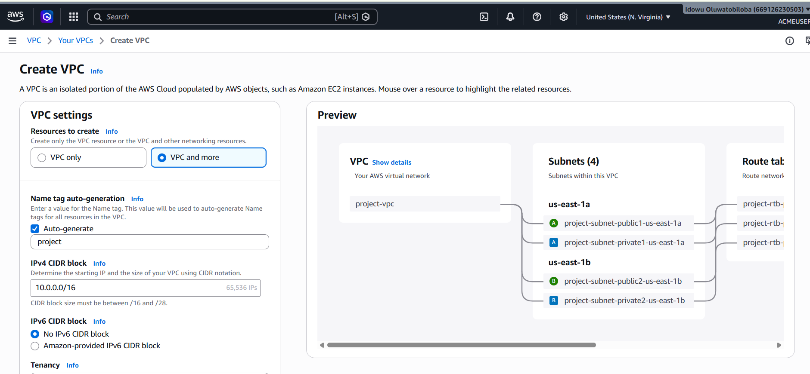
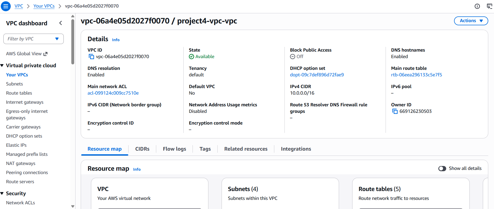

---

# Step 2: Create the Subnets

Two private subnets were created for the EC2 application instances.

The private subnets were:

```text
subnet-05ddb8e67b065a8e2
project4-vpc-subnet-private1-us-east-1a
```

and:

```text
subnet-0e112ca49ed006215
project4-vpc-subnet-private2-us-east-1b
```

The instances were intentionally placed in different Availability Zones.

This provides redundancy if one Availability Zone experiences a problem.

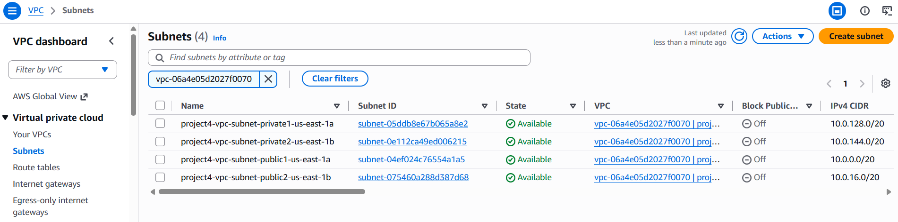

---

# Step 3: Configure the Internet Gateway

An Internet Gateway was attached to the VPC.

The Internet Gateway provides internet connectivity for resources located in public subnets.

The Application Load Balancer uses the public side of the architecture to receive requests from users.

The basic traffic flow is:

```text
Internet
   |
   v
Internet Gateway
   |
   v
Public Subnet
   |
   v
Application Load Balancer
```

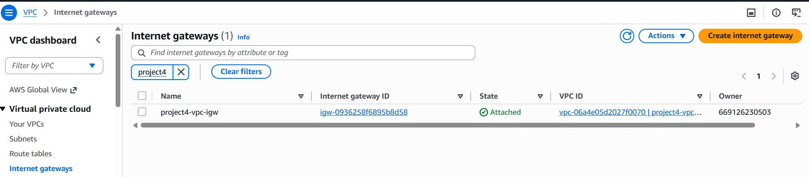

---

# Step 4: Configure Route Tables

Route tables were configured to control traffic between the public and private subnets.

The public route table provides a route to the Internet Gateway.

The private route table sends internet-bound traffic through the NAT Gateway.

Example private route:

```text
0.0.0.0/0 -> NAT Gateway
```

This allows private EC2 instances to access the internet for tasks such as installing operating system updates and Python packages without exposing the instances directly to the internet.

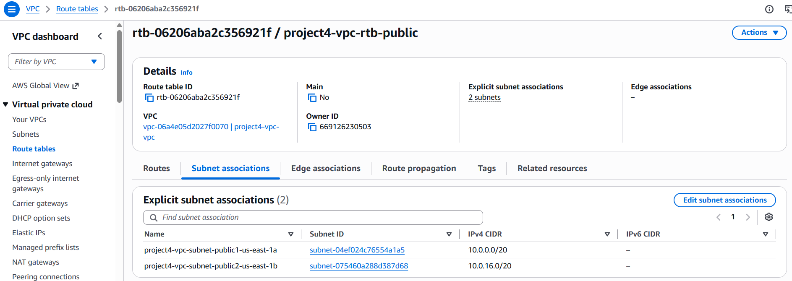
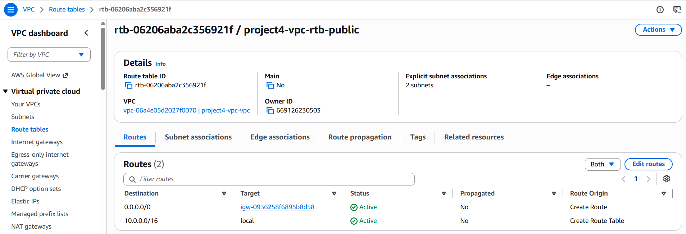
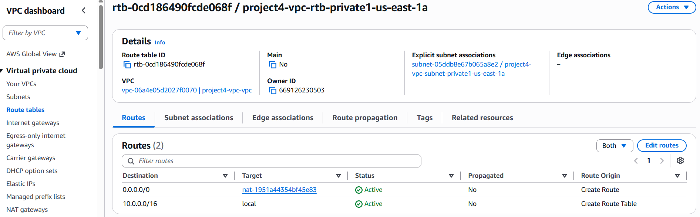

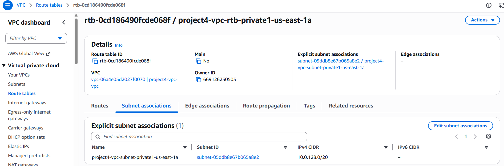

---

# Step 5: Create the NAT Gateway

A NAT Gateway was created to provide outbound internet access to the EC2 instances located in private subnets.

The traffic flow is:

```text
Private EC2
     |
     v
Private Route Table
     |
     v
NAT Gateway
     |
     v
Internet Gateway
     |
     v
Internet
```

The EC2 instances can therefore download packages and updates while remaining in private subnets.

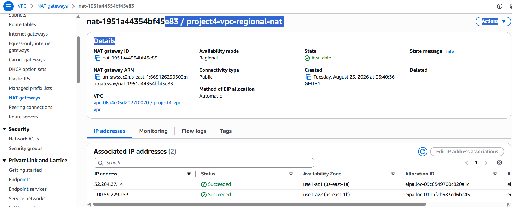

---

# Step 6: Configure Security Groups

Security Groups were created to control communication between the AWS resources.

The EC2 instances use a security group that allows application traffic from the Application Load Balancer.

The RDS database uses a separate security group.

The database communication uses:

```text
MySQL
TCP
Port 3306
```

The general communication flow is:

```text
Internet
   |
   v
Application Load Balancer
   |
   v
EC2 Instances
   |
   v
RDS MySQL
``` 

The RDS security group allows MySQL traffic from the appropriate application security group rather than exposing port 3306 directly to the internet.

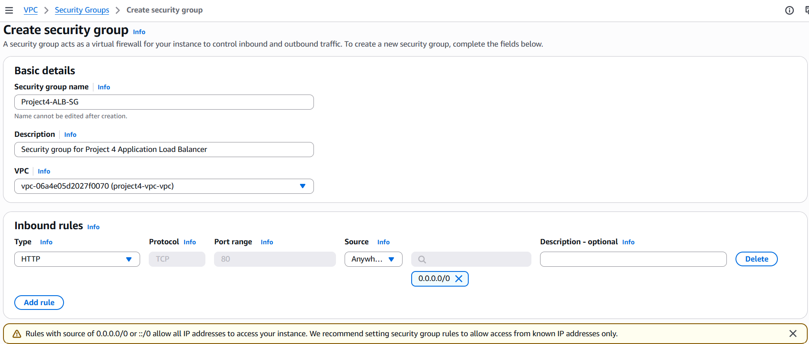
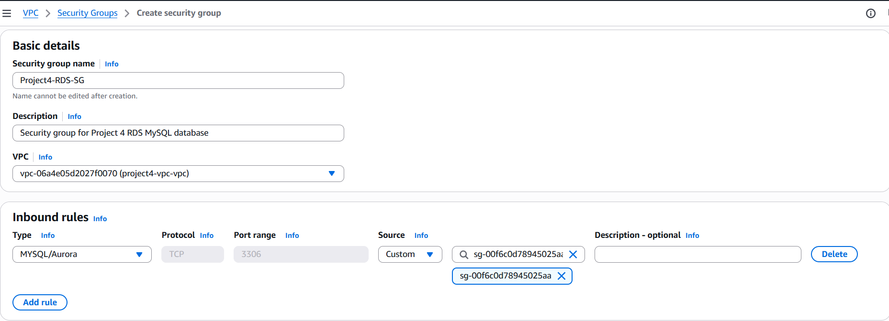
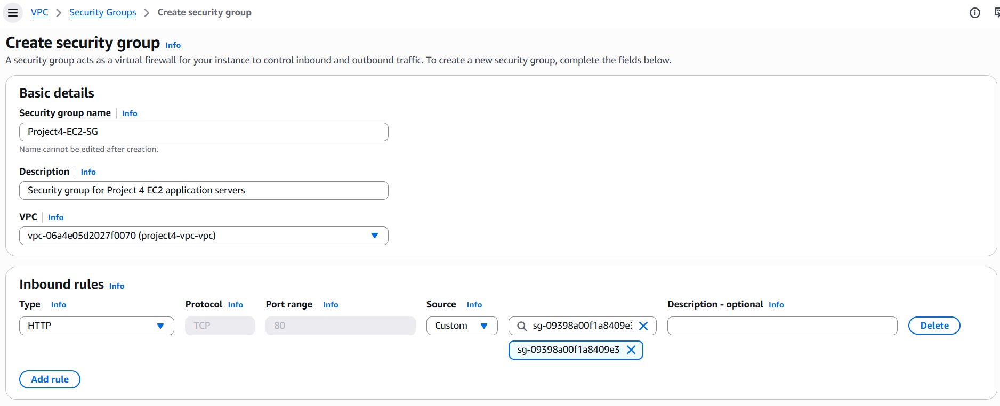
---

# Step 7: Create the Amazon RDS MySQL Database

Amazon RDS was used as the managed database for the application.

The database configuration was:

```text
Engine:
MySQL

Initial Database Name:
statusdashboard

Username:
admin

Port:
3306

DB Parameter Group:
default.mysql8.4

Option Group:
default:mysql-8-4

Encryption:
Enabled
```

The RDS instance became:

```text
Available
```

The database endpoint is:

```text
project4-mysql.c87uscy8my2i.us-east-1.rds.amazonaws.com
```

The Flask application uses this endpoint to connect to MySQL.

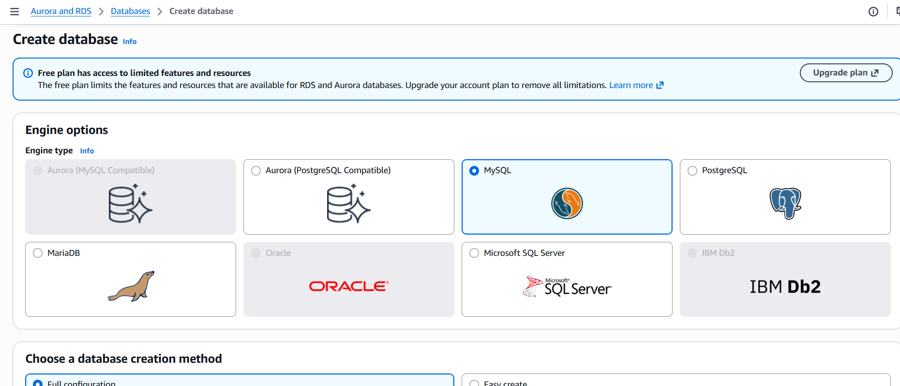
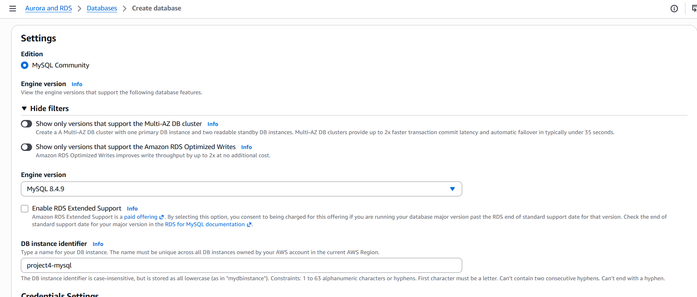
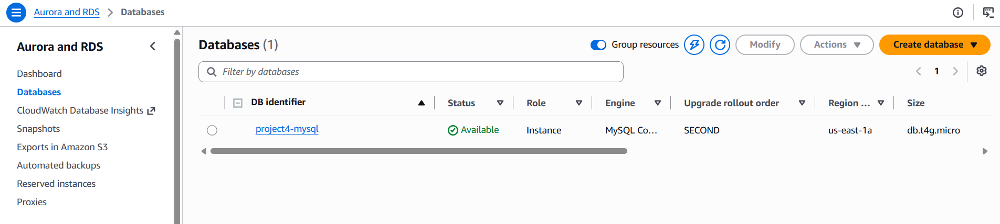

---


# Step 8: Create the EC2 Launch Template

A Launch Template was created to define how the application EC2 instances should be launched.

The Launch Template was named:

```text
project4-web-launch-template
```

The Launch Template contains the EC2 configuration and User Data required to automatically install and start the Flask application.

The Launch Template is then used by the Auto Scaling Group.

```text
Launch Template
       |
       v
Auto Scaling Group
       |
       +-------- EC2 Instance 1
       |
       +-------- EC2 Instance 2
```

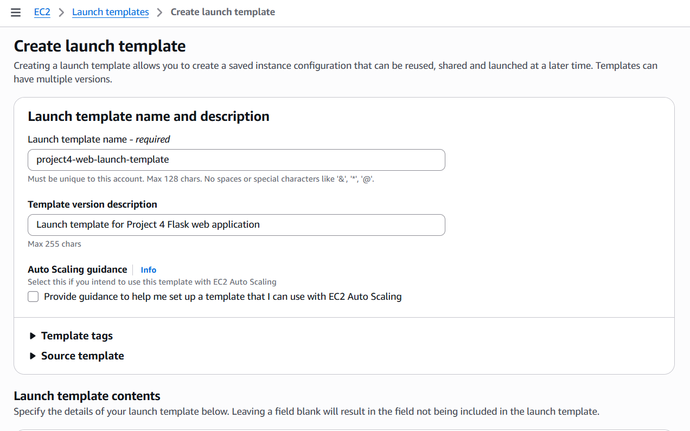
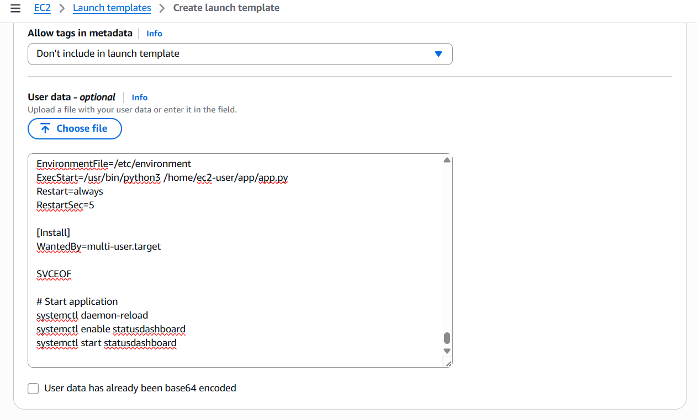

---

# Step 9: Configure EC2 User Data

The EC2 instances are automatically configured using a User Data script.

The script is stored in the repository as:

```text
scripts/userdata.sh
```

The User Data script performs tasks including:

- Updating the operating system
- Installing Python
- Installing pip
- Installing Git
- Creating the application directory
- Installing Flask
- Installing PyMySQL
- Installing cryptography
- Configuring the RDS database connection
- Creating the systemd service
- Starting the Flask application
- Enabling the application to restart automatically

The bootstrap process is:

```text
EC2 Starts
    |
    v
User Data Executes
    |
    v
Install Python
    |
    v
Install Dependencies
    |
    v
Configure Database
    |
    v
Create Flask Service
    |
    v
Start Application
```


---

# Step 10: Create the Auto Scaling Group

An Auto Scaling Group was created to maintain the desired number of application instances.

The Auto Scaling Group was named:

```text
project4-web-asg
```

The desired capacity was:

```text
2
```

The two instances were distributed across:

```text
us-east-1a
us-east-1b
```

This means the application does not depend on a single EC2 instance.

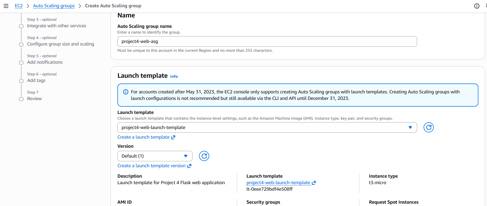
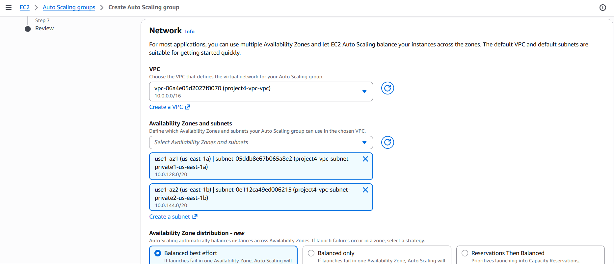

---

# Step 11: Verify the EC2 Instances

The Auto Scaling Group successfully launched two EC2 instances.

The instances were running in:

```text
us-east-1a
us-east-1b
```

Both instances were healthy.

The final Auto Scaling Group status was:

```text
2/2 Healthy
```

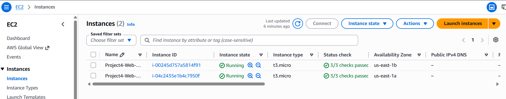

---

# Step 12: Create the Target Group

A Target Group was created for the EC2 application instances.

The Target Group sends traffic from the Application Load Balancer to the EC2 instances.

The application uses:

```text
Protocol:
HTTP

Port:
80
```

The health check configuration uses:

```text
Health Check Protocol:
HTTP

Health Check Path:
/health
```

The `/health` endpoint verifies that the Flask application is running and can successfully communicate with the database.

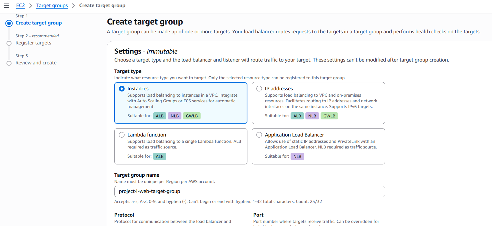
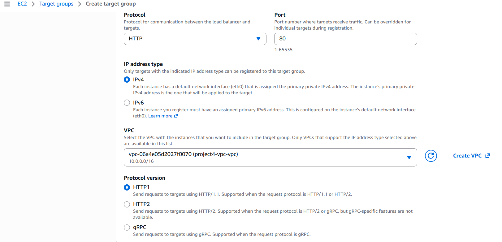
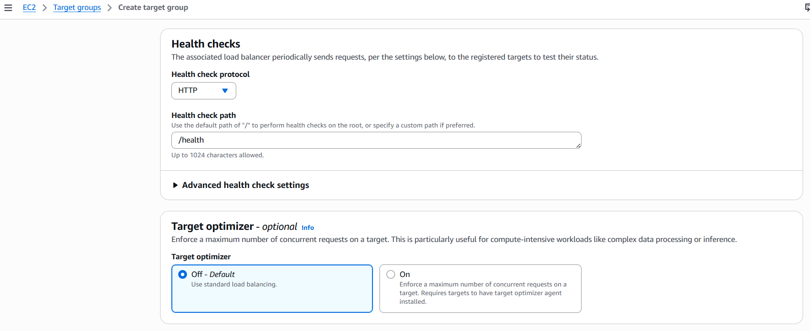

---


# Step 13: Create the Application Load Balancer

An Application Load Balancer was created to provide a single endpoint for users.

The ALB was configured to listen on:

```text
HTTP
Port 80
```

The ALB forwards requests to the Target Group containing the EC2 instances.

The architecture is:

```text
User
 |
 v
Application Load Balancer
 |
 +-------------------+
 |                   |
 v                   v
EC2 #1              EC2 #2
us-east-1a          us-east-1b
```

The Application Load Balancer became:

```text
Active
```

The DNS name was:

```text
project4-web-alb-55605889.us-east-1.elb.amazonaws.com
```

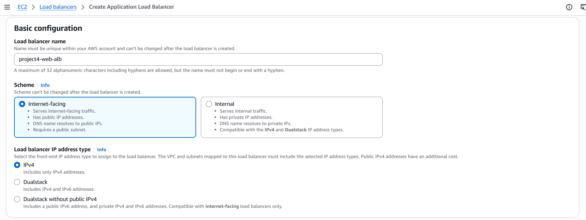
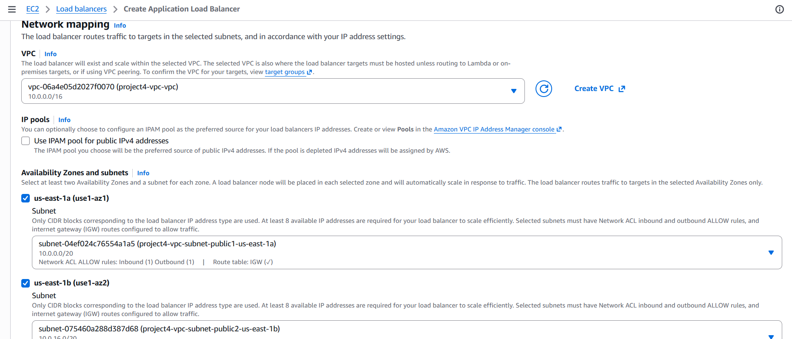
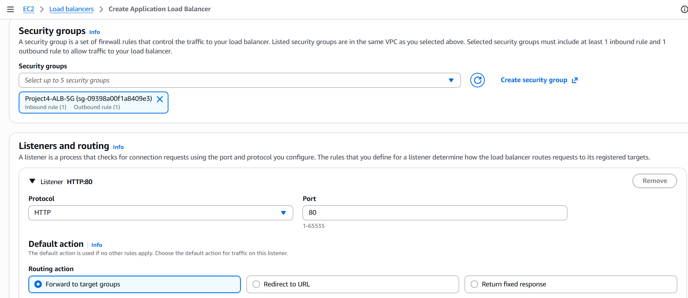
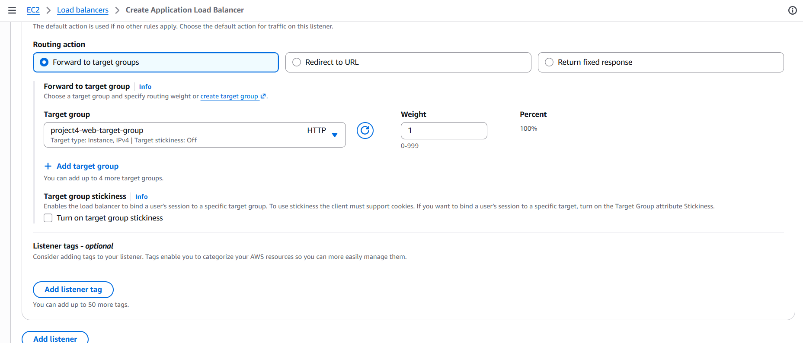


---

# Step 14: Access the Team Status Dashboard

The application was accessed using the Application Load Balancer DNS name.

The dashboard displayed:

```text
Team Status Dashboard

Served by: ip-10-0-131-202.ec2.internal

1
On Track

0
At Risk

0
Blocked

1
Teams
```

The application successfully displayed a stored database record:

```text
Team A / AWS Project 4 — on_track

Project 4 deployment is working successfully.

by MJ & Michael
```

This confirmed that:

- The ALB was working
- The EC2 instances were working
- The Flask application was working
- The application could connect to RDS
- Data was successfully stored and retrieved from MySQL

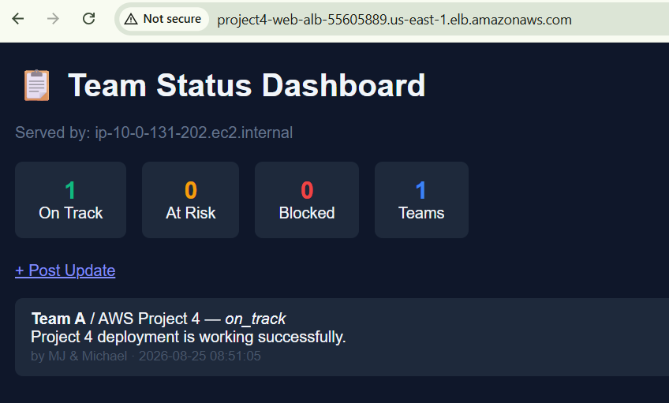

---

# Step 15: Test the Application

The application was tested by creating a status update.

Example:

```text
Team Name:
Team A

Project:
AWS Project 4

Status:
On Track

Message:
Project 4 deployment is working successfully.

Author:
MJ & Michael
```

After submitting the update, the information appeared on the dashboard.

This confirmed that the application could write data to RDS and retrieve it successfully.


---

# Final Architecture

The completed project architecture is:

```text
                              USERS
                                |
                                v
                     +--------------------+
                     | Application Load   |
                     |      Balancer      |
                     |      HTTP :80      |
                     +---------+----------+
                               |
                    +----------+----------+
                    |                     |
                    v                     v
             +-------------+       +-------------+
             |    EC2 #1   |       |    EC2 #2   |
             | us-east-1a  |       | us-east-1b  |
             |   PRIVATE   |       |   PRIVATE   |
             +------+------+       +------+------+
                    |                     |
                    +----------+----------+
                               |
                               v
                      +----------------+
                      |   Amazon RDS   |
                      |     MySQL      |
                      |     :3306      |
                      +----------------+
```

The private EC2 instances use the NAT Gateway for outbound internet access:

```text
EC2
 |
 v
Private Route Table
 |
 v
NAT Gateway
 |
 v
Internet Gateway
 |
 v
Internet
```

---

# Project Structure

The final GitHub repository is organized as follows:

```text
project-4-ha-autoscaling/
│
├── application/
│   ├── app.py
│   └── requirements.txt
│
├── scripts/
│   └── userdata.sh
│
├── screenshots/
|
│
├── .gitignore
└── README.md
```

---

# .gitignore

The `.gitignore` file is used to prevent sensitive information and unnecessary files from being committed to GitHub.


```text
.env
.env.*
*.pem
*.key
__pycache__/
*.pyc
.venv/
venv/
.vscode/
.DS_Store
```


---


# What I Learned

Through this project, I learned how to:

- Create an AWS VPC
- Configure public and private subnets
- Configure route tables
- Configure an Internet Gateway
- Configure a NAT Gateway
- Configure Security Groups
- Deploy Amazon RDS MySQL
- Create an EC2 Launch Template
- Use EC2 User Data
- Create an Auto Scaling Group
- Deploy EC2 instances across multiple Availability Zones
- Create an Application Load Balancer
- Configure a Target Group
- Configure health checks
- Deploy a Python Flask application
- Connect Flask to Amazon RDS MySQL
- Store and retrieve application data
- Verify application health
- Demonstrate high availability
- Document an AWS project using GitHub

---

# Conclusion

This project demonstrates how multiple AWS services can be combined to create a highly available web application.

The Application Load Balancer provides a single entry point for users and distributes traffic across healthy EC2 instances.

The Auto Scaling Group maintains multiple application instances across different Availability Zones.

Amazon RDS provides a managed MySQL database for persistent application data.

Private subnets provide an additional layer of network isolation for the application servers, while the NAT Gateway provides outbound internet connectivity when required.

The final result is a working Team Status Dashboard with:

```text
2 EC2 Instances
2 Availability Zones
1 Application Load Balancer
1 Auto Scaling Group
1 RDS MySQL Database
1 Flask Application
```

The final deployment reached:

```text
2/2 Healthy
```

and successfully served the Team Status Dashboard through the Application Load Balancer.

---

# Cleanup

AWS resources can generate charges while they are running.

After completing the project, review and delete resources that are no longer required.

Depending on the deployment, review:

- Auto Scaling Group
- EC2 instances
- Application Load Balancer
- Target Group
- Launch Template
- NAT Gateway
- Elastic IP
- RDS database
- Security Groups
- Route Tables
- Internet Gateway
- VPC

Resources should be deleted carefully because some AWS resources depend on other resources.

---

# Author

MJ & Michael

GitHub:

https://github.com/mikewills482
