# Project 4 — Highly Available Web App with Auto Scaling.

A highly available team status dashboard deployed on AWS using Amazon VPC, EC2, Auto Scaling, Application Load Balancer, Amazon RDS for MySQL, Nginx, Gunicorn, and Flask.

The purpose of this project is to demonstrate how to build and deploy a secure, scalable, and highly available web application using AWS infrastructure.

---

## Project Overview

TeamPulse is a centralized project status dashboard that allows teams to:

- Publish project updates
- Track project health
- Identify blocked projects
- Identify projects at risk
- Track completed work
- View updates from multiple teams
- Determine which EC2 instance served a request

The application is deployed across multiple Availability Zones using an Application Load Balancer and EC2 Auto Scaling Group.

---

# Architecture

```text
                              INTERNET
                                  │
                                  │ HTTP :80
                                  ▼
                    ┌─────────────────────────┐
                    │  Application Load       │
                    │  Balancer               │
                    │  Public Subnets         │
                    └────────────┬────────────┘
                                 │
                                 │ HTTP :80
                                 ▼
                    ┌─────────────────────────┐
                    │      Target Group       │
                    │       /health           │
                    └────────────┬────────────┘
                                 │
                    ┌────────────┴────────────┐
                    │                         │
                    ▼                         ▼
             ┌─────────────┐           ┌─────────────┐
             │   EC2 #1    │           │   EC2 #2    │
             │   AZ-A      │           │   AZ-B      │
             │   Private   │           │   Private   │
             │   Subnet    │           │   Subnet    │
             └──────┬──────┘           └──────┬──────┘
                    │                         │
                    └────────────┬────────────┘
                                 │
                                 │ TCP :3306
                                 ▼
                       ┌────────────────────┐
                       │     Amazon RDS     │
                       │       MySQL        │
                       │   Private Subnets  │
                       └────────────────────┘


Private EC2 instances
        │
        │ Outbound traffic
        ▼
   NAT Gateway
        │
        ▼
 Internet Gateway
        │
        ▼
     Internet
```

---

# AWS Services Used

| AWS Service | Purpose |
|---|---|
| Amazon VPC | Provides isolated networking |
| Public Subnets | Hosts the Application Load Balancer |
| Private Subnets | Hosts EC2 application servers and RDS |
| Internet Gateway | Provides internet connectivity to public resources |
| NAT Gateway | Provides outbound internet access to private resources |
| Security Groups | Controls network access |
| Amazon EC2 | Runs the Flask application |
| EC2 Launch Template | Defines the EC2 configuration |
| Auto Scaling Group | Maintains multiple EC2 instances |
| Application Load Balancer | Distributes incoming traffic |
| Target Group | Registers and health-checks EC2 instances |
| Amazon RDS MySQL | Stores application data |
| Nginx | Acts as the web server/reverse proxy |
| Gunicorn | Runs the Flask application |
| Flask | Provides the application backend |

---

# 1.  Create the VPC

I created the VPC using the **VPC and more** option.

### VPC Configuration

| Setting | Value |
|---|---|
| VPC Name | Project4 |
| IPv4 CIDR | `10.0.0.0/16` |
| Availability Zones | 2 |
| Public Subnets | 2 |
| Private Subnets | 2 |
| NAT Gateway | Regional |
| VPC Endpoints | None |

The VPC contains two Availability Zones:

```text
Project4 VPC
CIDR: 10.0.0.0/16

Availability Zone A
├── Public Subnet
└── Private Subnet

Availability Zone B
├── Public Subnet
└── Private Subnet
```

### Why two Availability Zones?

Two Availability Zones provide redundancy.

If one Availability Zone becomes unavailable, the application can continue operating from the second Availability Zone.


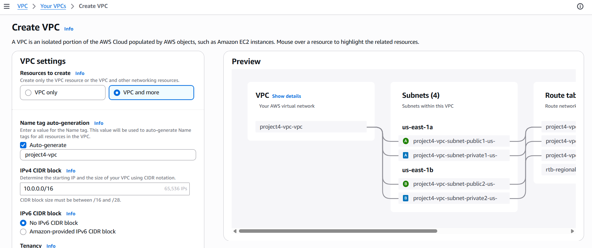
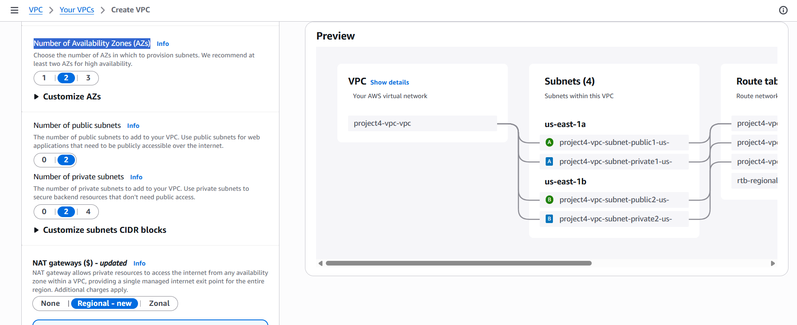


# 2.  Internet Gateway

An Internet Gateway was automatically created and attached to the VPC.

The Internet Gateway provides internet connectivity for resources located in public subnets.

The Application Load Balancer is deployed into the public subnets and receives internet traffic through the Internet Gateway.

```text
Internet
   │
   ▼
Internet Gateway
   │
   ▼
Public Subnets
   │
   ▼
Application Load Balancer
```

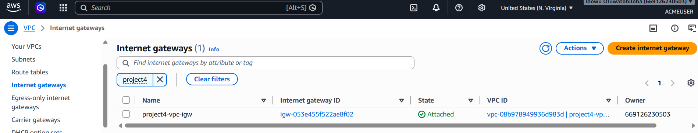

---

# 3.  NAT Gateway

A **Regional NAT Gateway** was created for the VPC.

The NAT Gateway allows EC2 instances in private subnets to initiate outbound internet connections without making the EC2 instances publicly accessible.

This is useful because the EC2 User Data script needs to download and install application dependencies.

Examples include:

- Python packages
- Flask
- PyMySQL
- Gunicorn
- Nginx
- System updates

Traffic flows like this:

```text
Private EC2
     │
     ▼
NAT Gateway
     │
     ▼
Internet Gateway
     │
     ▼
Internet
```

The EC2 instances remain in private subnets and do not require public IP addresses.

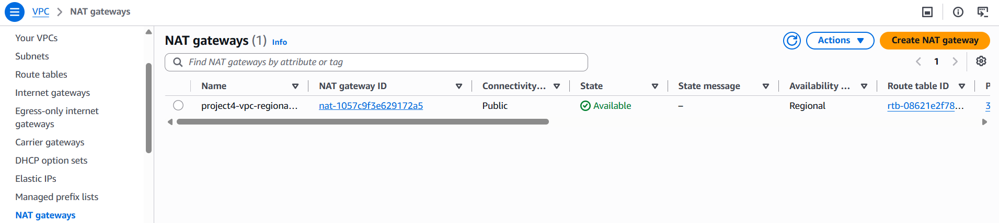

---

# 4. Security Groups

Three security groups were created.

---

## 4.1 Application Load Balancer Security Group

### Name

```text
Project4-ALB-SG
```

### Inbound Rule

| Type | Protocol | Port | Source |
|---|---|---:|---|
| HTTP | TCP | 80 | `0.0.0.0/0` |

This allows users on the internet to access the Application Load Balancer.

```text
Internet
    │
    │ HTTP :80
    ▼
ALB
```


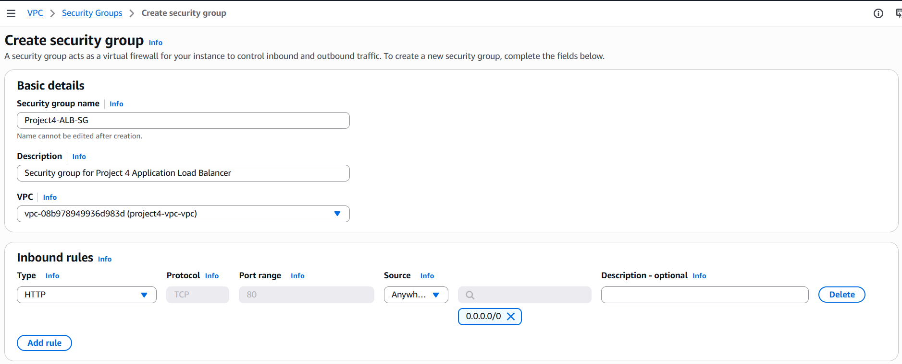

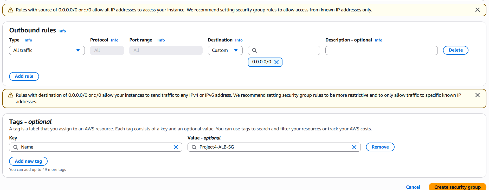


---

# 4.2 EC2 Security Group

### Name

```text
Project4-EC2-SG
```

### Inbound Rule

| Type | Protocol | Port | Source |
|---|---|---:|---|
| HTTP | TCP | 80 | `Project4-ALB-SG` |

The EC2 instances do not accept HTTP traffic directly from the internet.

Only the Application Load Balancer can send HTTP traffic to the EC2 instances.

```text
Internet
    │
    ▼
ALB
    │
    │ HTTP :80
    ▼
EC2
```

This provides an additional layer of network security.

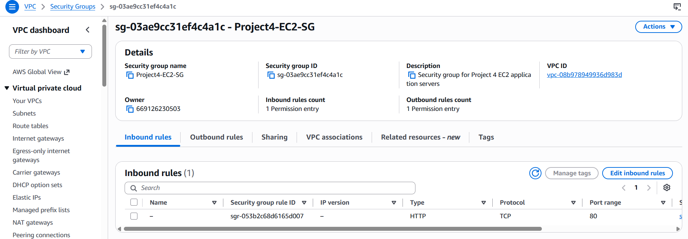

---

# 4.3 RDS Security Group

### Name

```text
Project4-RDS-SG
```

### Inbound Rule

| Type | Protocol | Port | Source |
|---|---|---:|---|
| MySQL/Aurora | TCP | 3306 | `Project4-EC2-SG` |

This means that only EC2 instances belonging to the EC2 security group can connect to the MySQL database.

The database is not exposed to the public internet.

```text
EC2
 │
 │ TCP :3306
 ▼
RDS MySQL
```

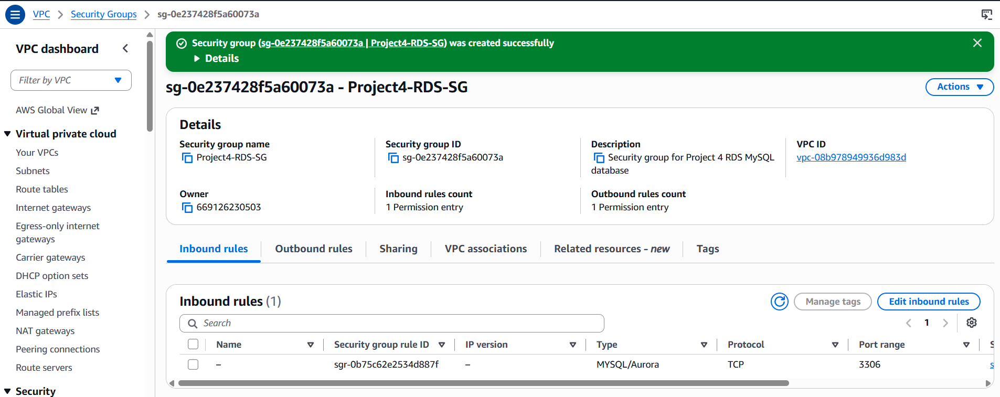

---

# 5. Create the RDS DB Subnet Group

A DB subnet group was created:

```text
Project4-DB-Subnet-Group
```

The DB subnet group uses both private subnets:

```text
Private Subnet
us-east-1a

Private Subnet
us-east-1b
```

This ensures that the database infrastructure is associated with private networking across the Availability Zones.


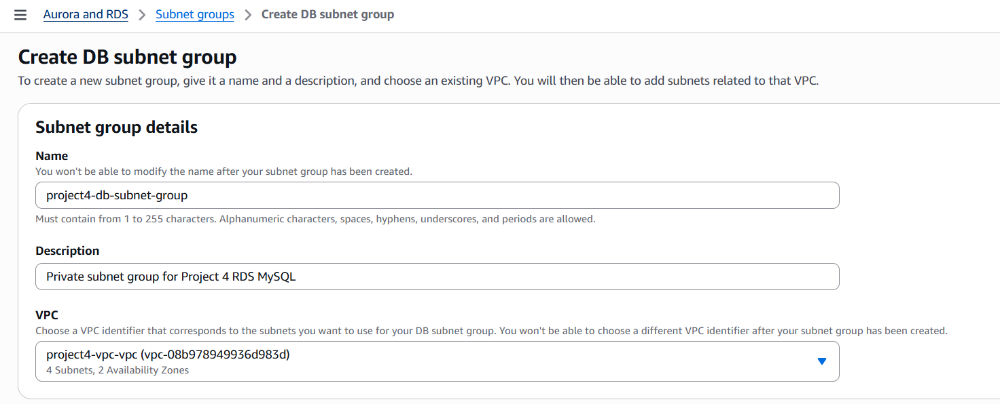

---

# 6. Create the Amazon RDS MySQL Database

I created an Amazon RDS MySQL database.

### Database Configuration

| Setting | Value |
|---|---|
| Engine | MySQL |
| Creation Method | Full Configuration |
| Template | Free Tier |
| Deployment | Single-AZ |
| VPC | Project4 VPC |
| DB Subnet Group | Project4-DB-Subnet-Group |
| Security Group | Project4-RDS-SG |

The RDS database is placed inside the private network and is accessible only by the EC2 application servers.

### Database Name

```text
statusdashboard
```

### Database User

```text
admin
```

The password should be stored securely and should not be committed to GitHub.


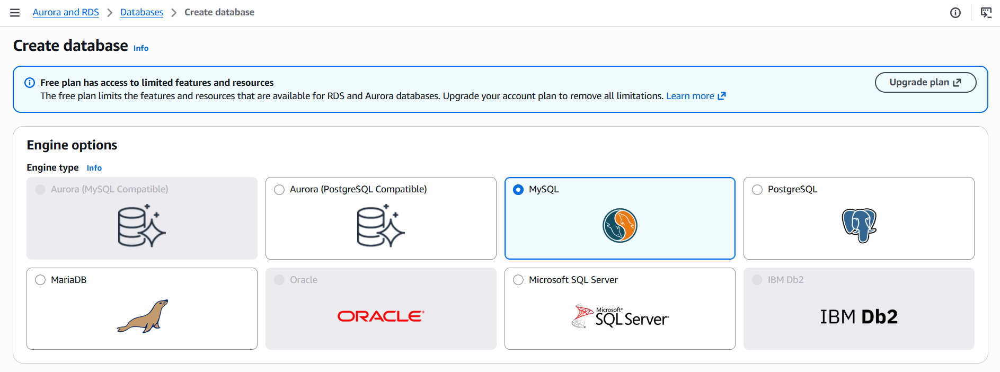


---

# 7. Create the EC2 Launch Template

An EC2 Launch Template was created:

```text
Project4-Web-Launch-Template
```

### Configuration

| Setting | Value |
|---|---|
| Operating System | Amazon Linux 2023 |
| Instance Type | `t3.micro` |
| VPC | Project4 VPC |
| Security Group | Project4-EC2-SG |
| User Data | Flask deployment script |

Amazon Linux 2023 was selected as the operating system.

The User Data script automatically installs and configures the application when an EC2 instance launches.


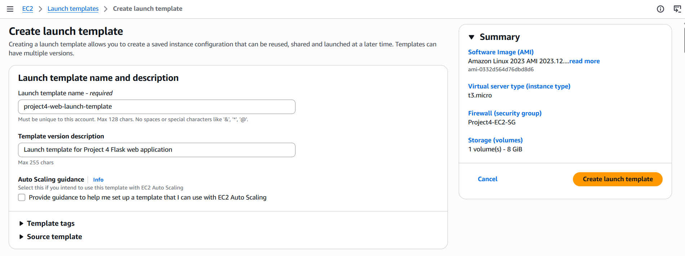
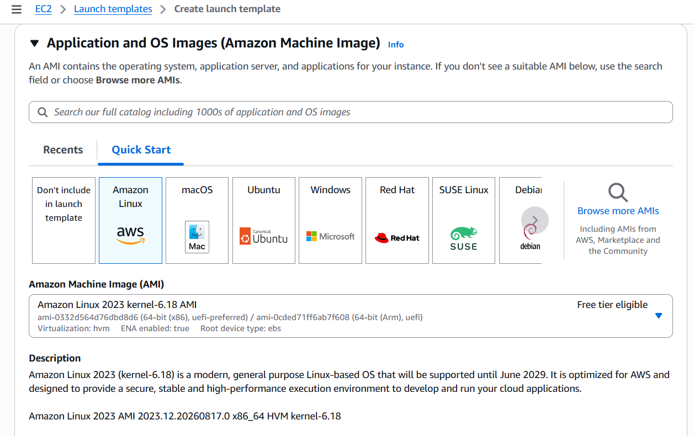


---

# 8. EC2 User Data

The EC2 User Data script automates the application deployment.

The script performs the following operations:

```text
1. Update Amazon Linux
2. Install Python
3. Install pip
4. Install Nginx
5. Create application directory
6. Create Flask application
7. Create Python virtual environment
8. Install Flask
9. Install PyMySQL
10. Install Gunicorn
11. Configure RDS connection
12. Create systemd service
13. Configure Nginx
14. Start Gunicorn
15. Start Nginx
16. Enable services on boot
```

The application stack is:

```text
Nginx
   │
   ▼
Gunicorn
   │
   ▼
Flask
   │
   ▼
PyMySQL
   │
   ▼
Amazon RDS MySQL
```

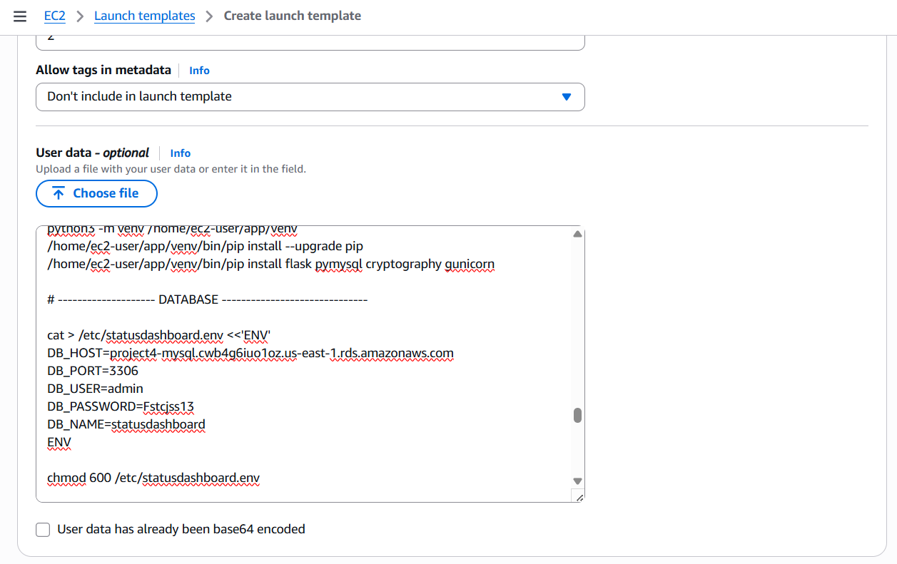

---

# 9. Create the Auto Scaling Group

An Auto Scaling Group was created using:

```text
Project4-Web-Launch-Template
```

The Auto Scaling Group uses the Project4 VPC.

Both private subnets were selected:

```text
Private Subnet AZ-A
Private Subnet AZ-B
```

### Capacity Configuration

| Setting | Value |
|---|---:|
| Minimum | 2 |
| Desired | 2 |
| Maximum | 2 |

This ensures that two EC2 instances are running.

```text
             Auto Scaling Group
                     │
          ┌──────────┴──────────┐
          │                     │
          ▼                     ▼
       EC2 #1                EC2 #2
       AZ-A                  AZ-B
```

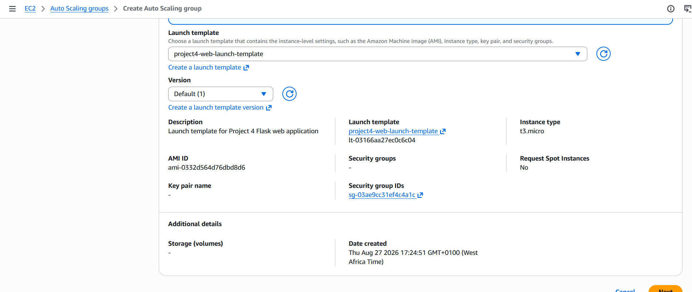
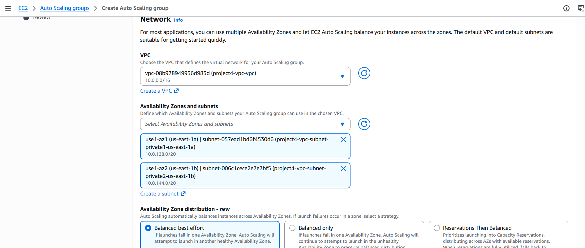
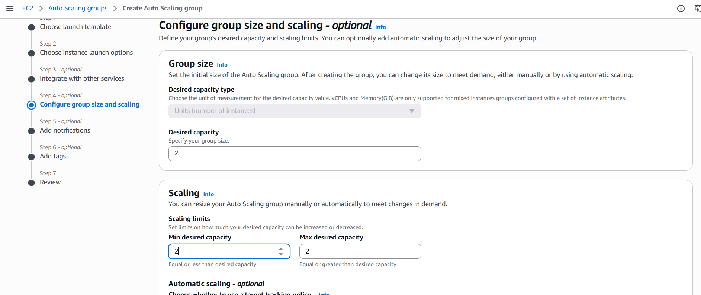

---

# 10. Create the Target Group

A Target Group was created for the EC2 instances.

### Configuration

```text
Target Type:
Instances
```

The Target Group uses the same Project4 VPC.

### Health Check

```text
Protocol: HTTP
Path: /health
Port: Traffic Port
```

The `/health` endpoint is provided by the Flask application.

A healthy response looks like:

```json
{
    "status": "healthy",
    "instance": "ip-10-0-x-x"
}
```

The Application Load Balancer uses this endpoint to determine whether an EC2 instance is healthy.


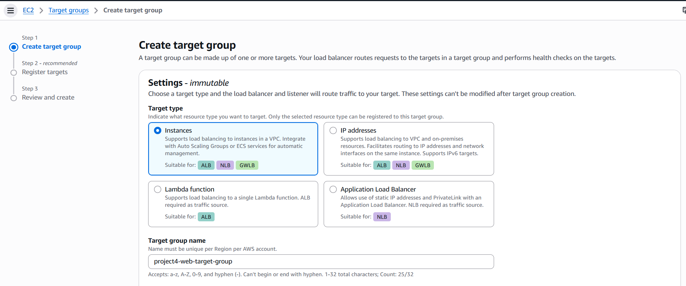
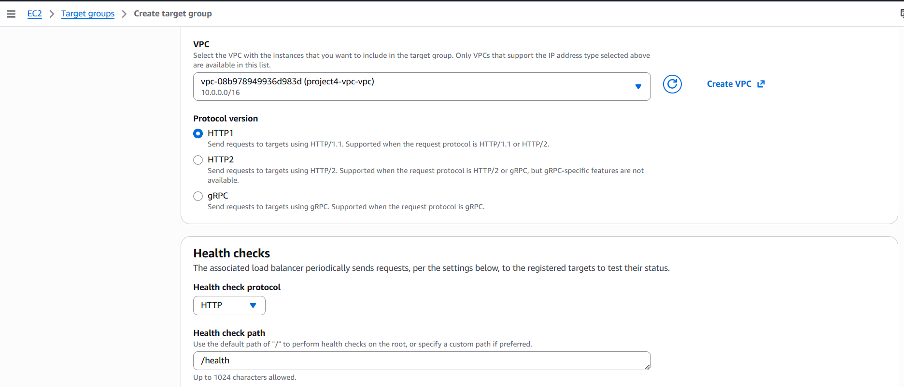
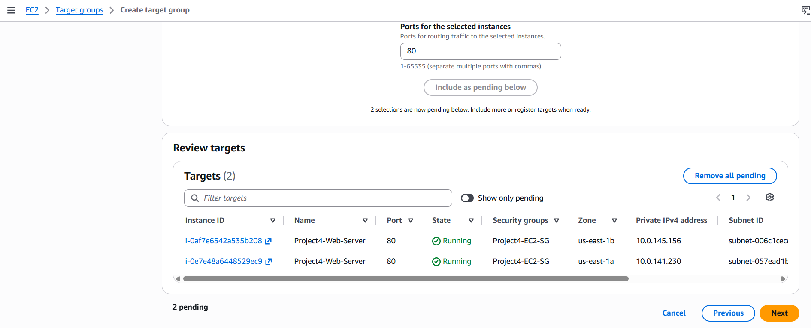


---

# 11. Create the Application Load Balancer

An Application Load Balancer was created.

### Configuration

| Setting | Value |
|---|---|
| Name | Project4-ALB |
| Scheme | Internet-facing |
| IP Address Type | IPv4 |
| VPC | Project4 VPC |
| Subnets | Public AZ-A + Public AZ-B |
| Security Group | Project4-ALB-SG |
| Listener | HTTP :80 |
| Target Group | Project4 Target Group |

The ALB is placed in the public subnets while the EC2 instances remain in the private subnets.

This is an important part of the architecture.

```text
                  INTERNET
                     │
                     ▼
             ┌───────────────┐
             │      ALB      │
             │ Public Subnet │
             └───────┬───────┘
                     │
                     ▼
              Private EC2
                     │
                     ▼
                Private RDS
```


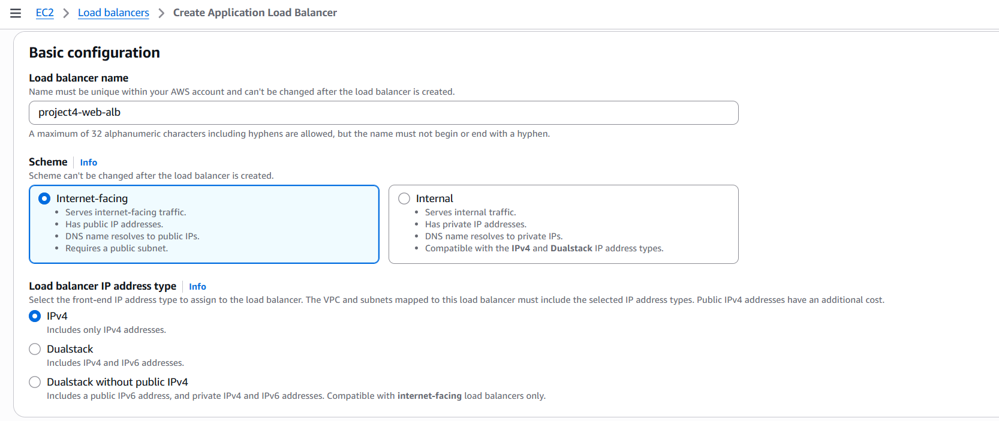
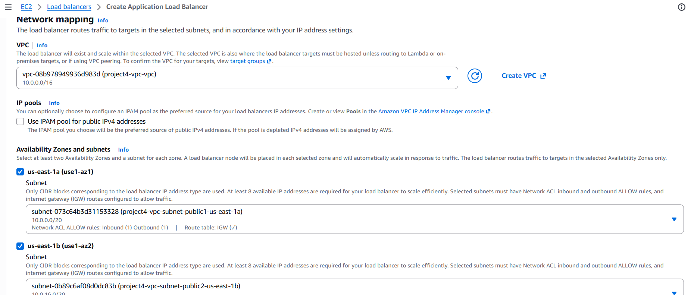
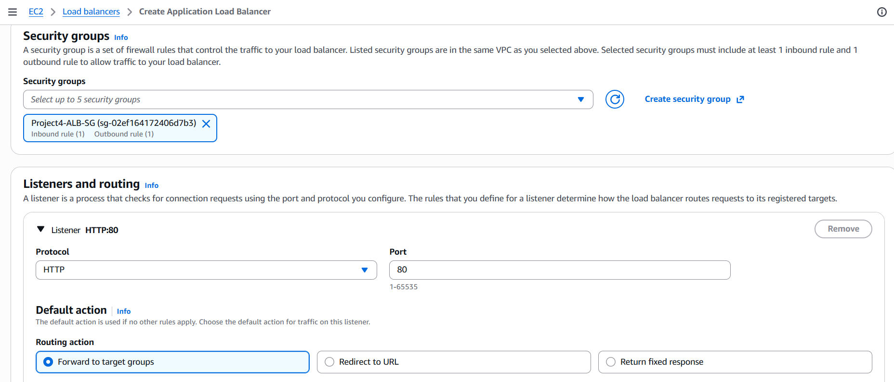
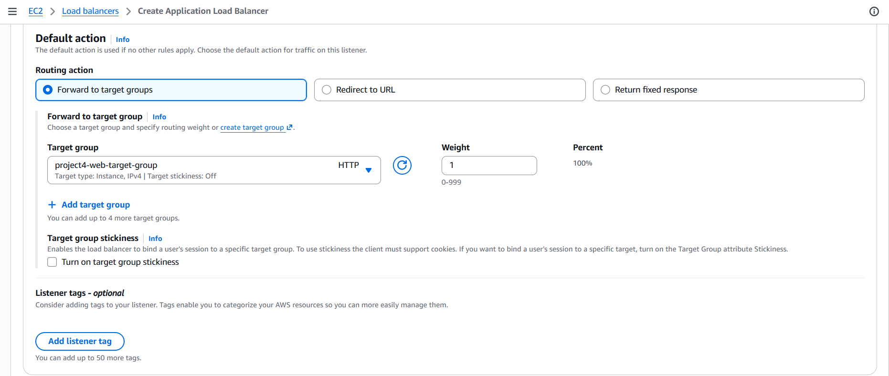

---

# 12. Health Check Architecture

The Application Load Balancer sends requests to:

```text
GET /health
```

The request travels through:

```text
ALB
 │
 ▼
Target Group
 │
 ▼
EC2
 │
 ▼
Nginx
 │
 ▼
Gunicorn
 │
 ▼
Flask
 │
 ▼
RDS
```

If Flask successfully connects to RDS:

```text
HTTP 200
```

The target is:

```text
HEALTHY
```

If the application cannot connect to RDS:

```text
HTTP 500
```

The target becomes:

```text
UNHEALTHY
```

---

# 13.  Highly Available Web App with Auto Scaling

The application uses a modern dark interface with:

- Gradient purple and blue colors
- Glass-style cards
- Responsive layout
- Project statistics
- Status badges
- Team avatars
- Project updates
- Mobile-friendly design
- Update submission form
- EC2 instance identification

The dashboard displays:

```text
ON TRACK
AT RISK
BLOCKED
COMPLETED
TEAMS
```

The dashboard also displays which EC2 instance served the request.

This makes it possible to demonstrate that traffic is being distributed between multiple EC2 instances.

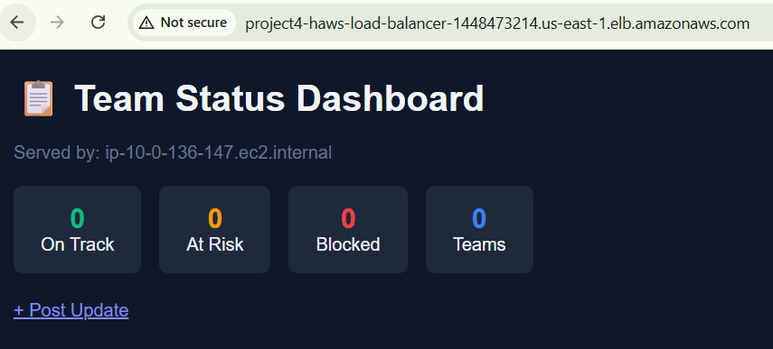

---

# 14. Post a Team Update

Users can publish updates using:

```text
/update
```

The form allows users to enter:

- Team name
- Project name
- Project status
- Update message
- Author name

Available statuses:

```text
On Track
At Risk
Blocked
Completed
```


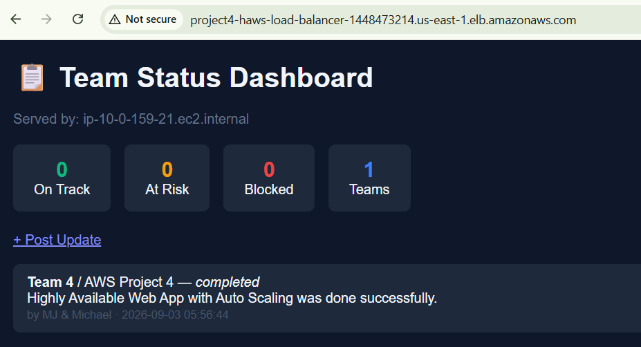


---


# 15. Security Architecture

The project uses layered network security.

## Internet → ALB

The ALB accepts:

```text
HTTP :80
Source: Internet
```

## ALB → EC2

The EC2 instances accept:

```text
HTTP :80
Source: Project4-ALB-SG
```

## EC2 → RDS

RDS accepts:

```text
MySQL :3306
Source: Project4-EC2-SG
```

Therefore:

```text
             INTERNET
                 │
                 │ :80
                 ▼
          ┌─────────────┐
          │     ALB     │
          └──────┬──────┘
                 │
                 │ :80
                 ▼
          ┌─────────────┐
          │     EC2     │
          │   PRIVATE   │
          └──────┬──────┘
                 │
                 │ :3306
                 ▼
          ┌─────────────┐
          │     RDS     │
          │   PRIVATE   │
          └─────────────┘
```

The RDS database is not directly accessible from the public internet.

---

# 16. Final Validation Checklist

## VPC

- [x] Project4 VPC created
- [x] CIDR `10.0.0.0/16`
- [x] Two Availability Zones
- [x] Two public subnets
- [x] Two private subnets
- [x] Internet Gateway attached
- [x] NAT Gateway created

## Security Groups

- [x] ALB security group created
- [x] ALB allows HTTP port 80
- [x] EC2 security group created
- [x] EC2 allows port 80 only from ALB security group
- [x] RDS security group created
- [x] RDS allows port 3306 only from EC2 security group

## RDS

- [x] MySQL database created
- [x] DB subnet group created
- [x] Private subnets selected
- [x] RDS security group attached
- [x] Database available

## EC2

- [x] Amazon Linux 2023 selected
- [x] t3.micro selected
- [x] Launch Template created
- [x] User Data configured
- [x] Flask installed
- [x] Gunicorn installed
- [x] Nginx installed

## Auto Scaling

- [x] Auto Scaling Group created
- [x] Minimum = 2
- [x] Desired = 2
- [x] Maximum = 2
- [x] Private subnets selected
- [x] Instances distributed across Availability Zones

## Load Balancer

- [x] Internet-facing ALB created
- [x] IPv4 selected
- [x] Public subnets selected
- [x] ALB security group attached
- [x] HTTP port 80 listener configured
- [x] Target Group attached

## Health Checks

- [x] `/health` endpoint created
- [x] Target Group health check configured
- [x] EC2 instances registered
- [x] Targets healthy

---

# 17. Final Architecture Summary

The completed architecture follows this model:

```text
                         USER
                           │
                           │ HTTP
                           ▼
                  ┌─────────────────┐
                  │      ALB        │
                  │  PUBLIC SUBNETS │
                  └────────┬────────┘
                           │
                           ▼
                 ┌──────────────────┐
                 │   TARGET GROUP    │
                 │     /health      │
                 └────────┬─────────┘
                          │
             ┌────────────┴────────────┐
             │                         │
             ▼                         ▼
      ┌─────────────┐           ┌─────────────┐
      │    EC2 #1   │           │    EC2 #2   │
      │     AZ-A    │           │     AZ-B    │
      │   PRIVATE   │           │   PRIVATE   │
      └──────┬──────┘           └──────┬──────┘
             │                         │
             └────────────┬────────────┘
                          │
                          │ MySQL :3306
                          ▼
                  ┌───────────────┐
                  │      RDS      │
                  │     MySQL     │
                  │    PRIVATE    │
                  └───────────────┘
```

---

# 18.  Project Outcome

This project demonstrates the deployment of a secure and highly available web application using AWS.

The final solution provides:

- ✅ Multi-AZ architecture
- ✅ Private EC2 instances
- ✅ Private RDS database
- ✅ Internet-facing Application Load Balancer
- ✅ Auto Scaling
- ✅ Health checks
- ✅ Security-group-based network isolation
- ✅ NAT Gateway for private subnet outbound access
- ✅ Automated EC2 provisioning
- ✅ Flask application
- ✅ Gunicorn application server
- ✅ Nginx reverse proxy
- ✅ MySQL persistence
- ✅ Responsive dashboard
- ✅ Team project status tracking

The architecture separates the **presentation, application, and database layers**, providing a strong foundation for scalability, availability, and security.

---

# Technology Stack

```text
Cloud
└── AWS

Networking
├── Amazon VPC
├── Public Subnets
├── Private Subnets
├── Internet Gateway
└── NAT Gateway

Compute
├── Amazon EC2
├── Launch Template
└── Auto Scaling Group

Load Balancing
├── Application Load Balancer
└── Target Group

Application
├── Python
├── Flask
├── Gunicorn
└── Nginx

Database
└── Amazon RDS MySQL

Security
└── AWS Security Groups
```

---
# 19. AWS Resource Cleanup

To avoid unexpected AWS charges after completing the project, delete resources that are no longer needed.

Pay special attention to:

NAT Gateway 

RDS MySQL 

Application Load Balancer

EC2 instances 

Auto Scaling Group

After cleanup, check the AWS Billing Dashboard to confirm there are no unwanted active resources or charges.

---
# 20. LICENSE

This project is licensed under the **MIT License**.


---

# 21. GitHub Repository

[View the project on GitHub](https://github.com/mikewills482/project-4-ha-autoscaling/tree/main)

